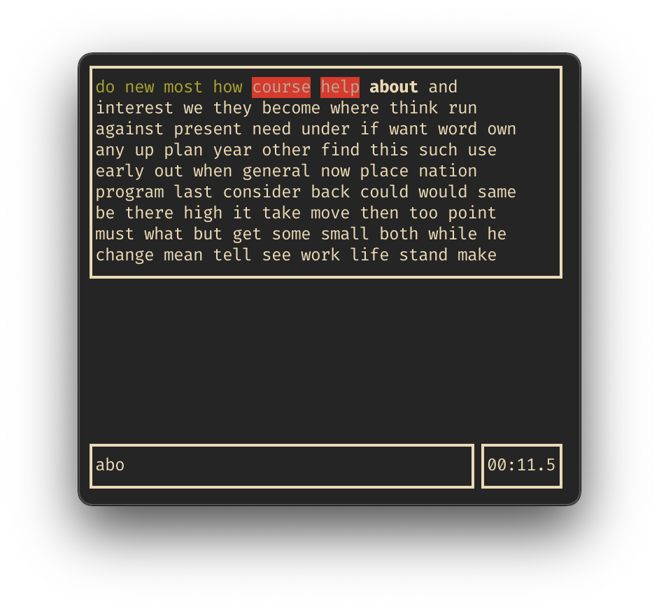

# typingterm

A typingtest for terminal power users.



## Usage

Clone this repository

```bash
git clone https://github.com/nathom/typingterm
```

Change into the directory and compile the program

```
cd typingterm && make
```

Run the program

```
./typingtest
```

